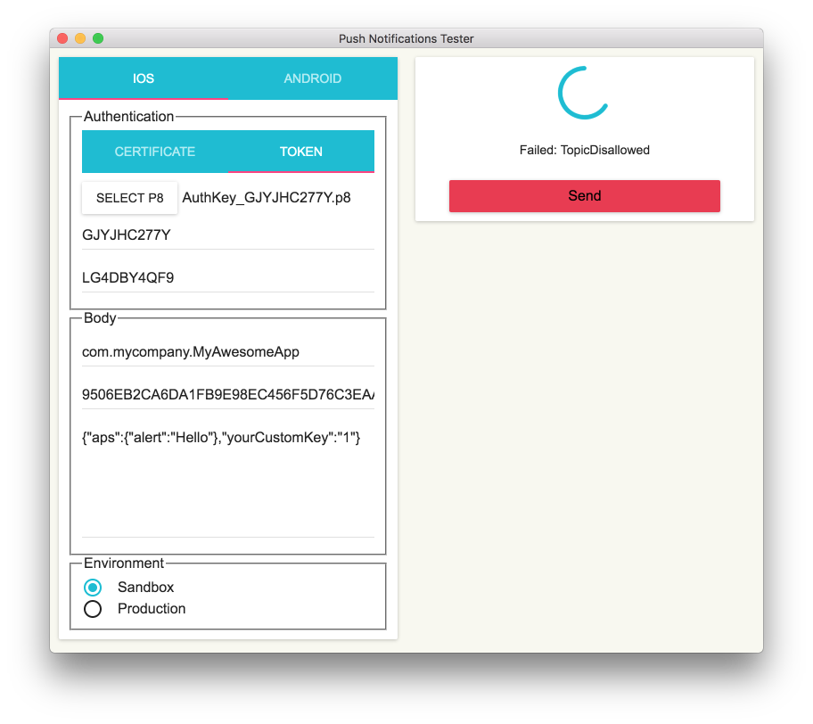
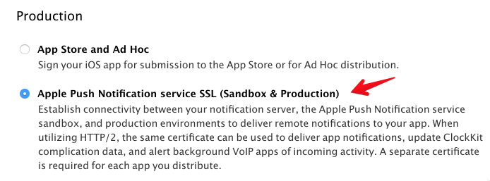
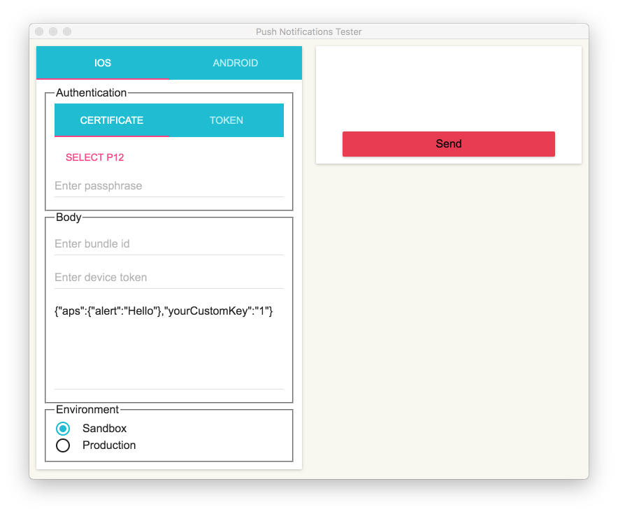
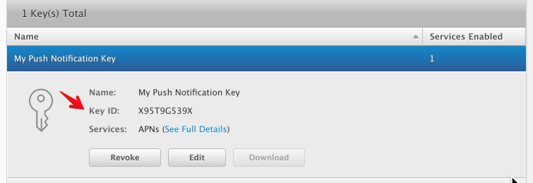
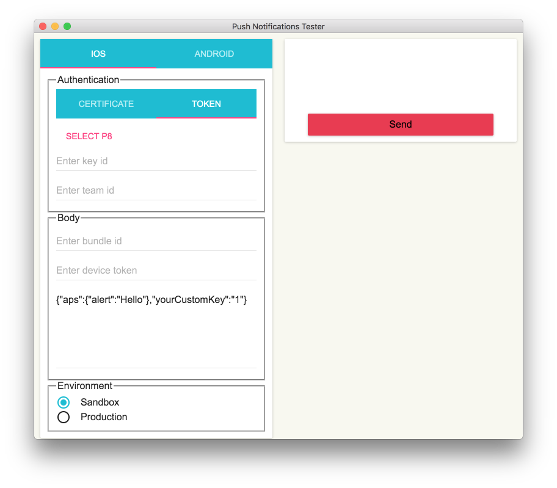
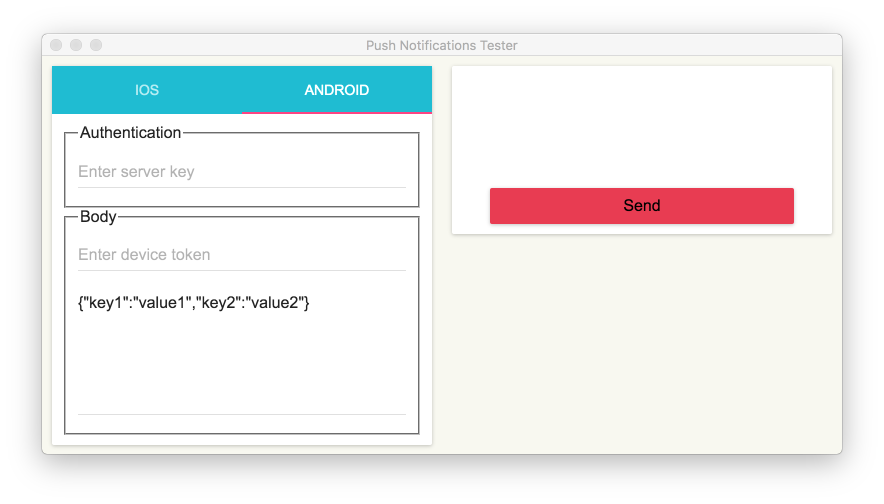
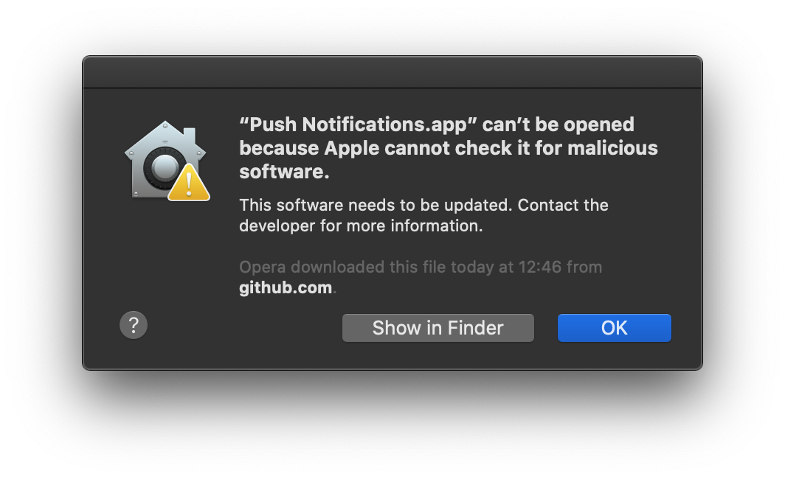
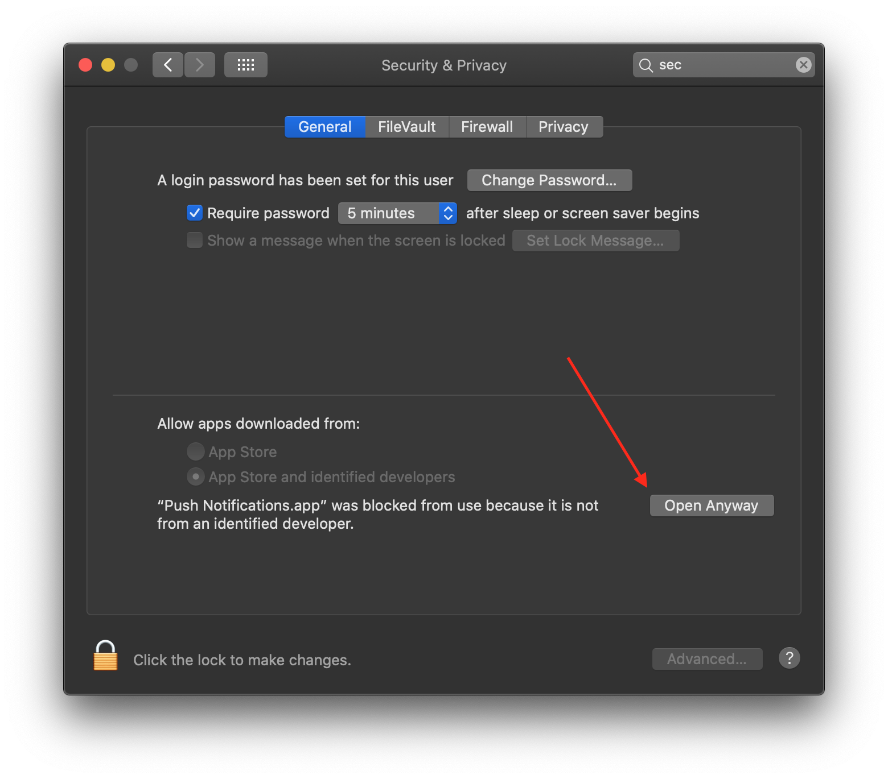

# ℙ𝕦𝕤𝕙 ℕ𝕠𝕥𝕚𝕗𝕚𝕔𝕒𝕥𝕚𝕠𝕟𝕤

❤️ Support my apps ❤️ 

- [Push Hero - pure Swift native macOS application to test push notifications](https://onmyway133.com/pushhero)
- [PastePal - Pasteboard, note and shortcut manager](https://onmyway133.com/pastepal)
- [Quick Check - smart todo manager](https://onmyway133.com/quickcheck)
- [Alias - App and file shortcut manager](https://onmyway133.com/alias)
- [My other apps](https://onmyway133.com/apps/)

❤️❤️😇😍🤘❤️❤️

## Description

- `PushNotitication` is an app used for testing push notifications on iOS and Android
- Support macOS, Windows, Linux
- Support using `certificate` and `token` for authentication with APNS
- Auto save settings

## How to install

* Download latest release from https://github.com/onmyway133/PushNotifications/releases 
  - If using macOS Catalina (10.15+), here is the instruction of [how to open the app](#opening-app-on-macos-catalina-1015)

## How to use
* iOS (APNs):
  - [iOS Provider Certificate](#ios-provider-certificates)
  - [iOS Authentication Token](#ios-authentication-token)
* Android (FCM):
  - [Android Server Key](#android-server-key)

Keep in mind: To connect to APNs you can use either `Provider certificate` or `Authentication Token`. They are **different ways** and `Authentication Token` is a new one.

**Main difference:** `Provider certificate` expires every year and needs to be regenerated (and reuploaded to your server as `.p12`). `Authentication Token` is unlimited and you don't have to recreate and reupload it.

### iOS Provider Certificate

- Read more [Provider Certificates](https://developer.apple.com/library/content/documentation/NetworkingInternet/Conceptual/RemoteNotificationsPG/CommunicatingwithAPNs.html#//apple_ref/doc/uid/TP40008194-CH11-SW1)
- Go to [Member Center](https://developer.apple.com/account/ios/certificate/distribution/create)
- Generate `Apple Push Notification service SSL (Sandbox & Production)`, this is now used for both sandbox and production. Download as `.cer` file
- Double click on `.cer` file to install into `Keychain`, then export it as `.p12` file

- In `PushNotifications`, select `.p12` file, fill out `passphase` if needed, fill out `bundle id`, `device token`, `message`, select `environment`
- `message` must be in json format, see [Creating the Remote Notification Payload](https://developer.apple.com/library/content/documentation/NetworkingInternet/Conceptual/RemoteNotificationsPG/CreatingtheNotificationPayload.html)

### iOS Authentication Token

- Read more [Authentication Tokens](https://developer.apple.com/library/content/documentation/NetworkingInternet/Conceptual/RemoteNotificationsPG/CommunicatingwithAPNs.html#//apple_ref/doc/uid/TP40008194-CH11-SW1)
- Go to [Member Center](https://developer.apple.com/account/ios/certificate/distribution/create)
- Create a `Key` for push notification. Download as `.p8` file.

- Note your `key id`

- Note your `team id` on [Account Membership](https://developer.apple.com/account/#/membership)

- In `PushNotifications`, select `.p8` file, fill out `key id`, `team id`, `bundle id`, `device token`, `message`, select `environment`

### Android Server Key

- Read about [
Firebase Cloud Messaging](https://firebase.google.com/docs/cloud-messaging/)
- Add or select project on [Firebase Console](https://console.firebase.google.com/u/0/)

- In `PushNotifications`, fill out `server key`, `device token`, `message`
- `message` must be in json format

## Opening app on macOS Catalina (10.15+)

If you installed the app on macOS Catalina using the `.dmg` file, you will probably see this window when trying to launch the app:

Just press `OK` and go to `System Preferences..` -> `Security & Privacy` -> `General` tab. There you need to press the button `Open Anyway`.

## Manual building

In case of issues with running the app on your version of OS, it's possible to easily build it yourself.

Steps:
1) Download or clone the repository
2) Install `node` on your computer (https://nodejs.org/en/)
3) Run `npm install` in the root of downloaded/cloned project
4) Verify that the app can be launched with the command `npm start` (optional)
5) Build the project to generate installable files:

- For building with `electron-builder` you need to run `npm run dist`. Generated files end up in the folder `dist` in the root of your project.

As a result `electron-builder` will generate:
- For macOS: `.zip`, `.dmg` (if you build using macOS)
- For Windows: `.msi` (if you build using Windows)
- For Linux: `.deb`, `.AppImage` (if you build using Linux)

Keep in mind: you cannot build for Windows or Linux, if you are using macOS, or vise versa. It creates installable files only for your current OS.

## Credit

- Icon http://emojione.com/
- Use [node-apn](https://github.com/node-apn/node-apn) under the hood

## Author

Khoa Pham, onmyway133@gmail.com

## License

**PushNotifications** is available under the MIT license. See the [LICENSE](https://github.com/onmyway133/PushNotifications/blob/master/LICENSE.md) file for more info.
